# Manual de Capacitación — AuditFlow

> Plataforma privada de asignación de servicios de auditoría.
> Este manual incluye capturas de pantalla reales del sistema (con datos de ejemplo) para capacitar a administradores y auditores.

---

## 1. Acceso al sistema

Entra a la URL de la plataforma (p. ej. `https://auditflow.hcar.cloud`) e inicia sesión con tu correo y contraseña.

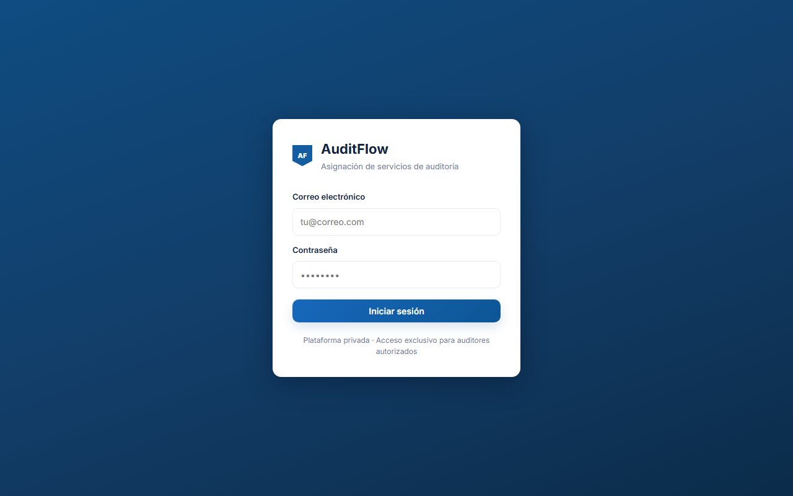

- El primer administrador usa el correo y contraseña definidos en el despliegue.
- Tras 10 intentos fallidos, el acceso se bloquea 5 minutos por IP.
- Cambia tu contraseña en **Seguridad** (arriba a la derecha).

---

## 2. Perfiles

| Perfil | Qué hace |
|---|---|
| **Administrador** | Centro de control: oportunidades, auditores, personal, clientes, usuarios, competencias, calendario, reportes y mapa. |
| **Auditor** | Su agenda: oportunidades compatibles, postularse, sus auditorías, calendario y documentos. |

---

## 3. Administrador — Centro de control

Al entrar verás el resumen ejecutivo: KPIs clicables, donut de estados, rendimiento de auditores y clientes.

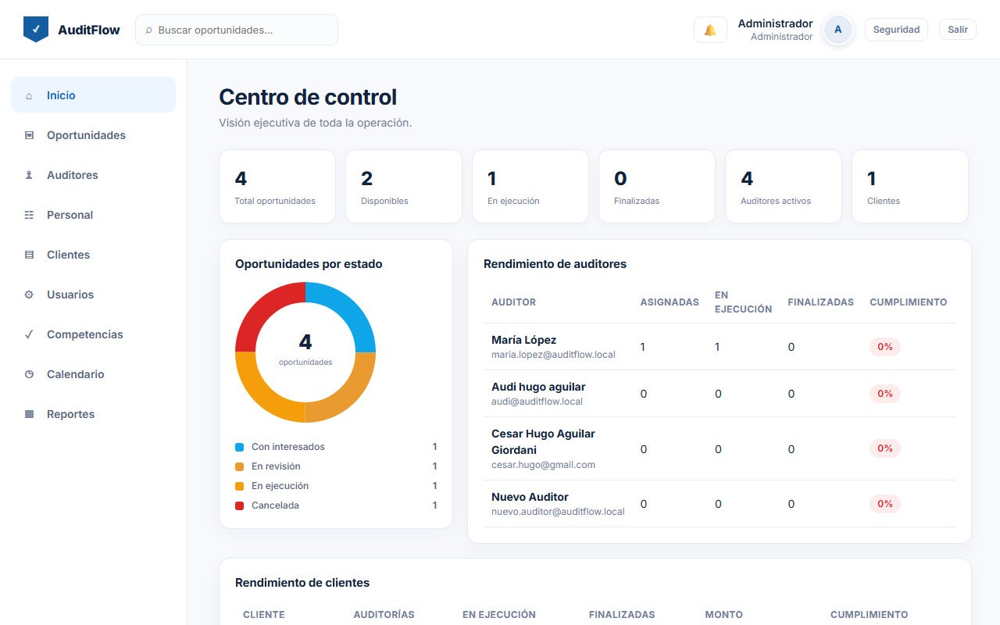

- Los **KPIs** son clicables: por ejemplo, "En ejecución" abre las oportunidades en ese estado.
- El **donut** muestra la distribución por estado.
- **Rendimiento de auditores / clientes** muestra asignadas, en ejecución, finalizadas y % de cumplimiento.

---

## 4. Administrador — Oportunidades

Menú **Oportunidades**: vista por defecto en **tarjetas** (folio, estado, título, cliente, ubicación, fechas, pago, competencias), con toggle **Tarjetas / Lista** y buscador.

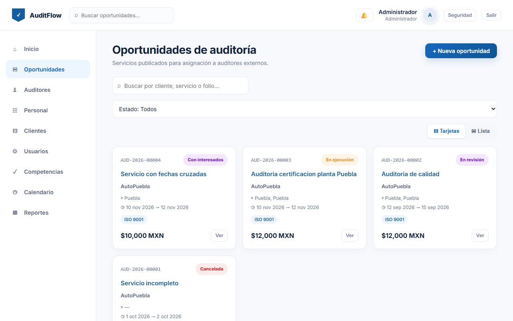

Para crear una: botón **+ Nueva oportunidad** → completa servicio, cliente, ubicación, fechas, pago, viáticos y competencias requeridas.

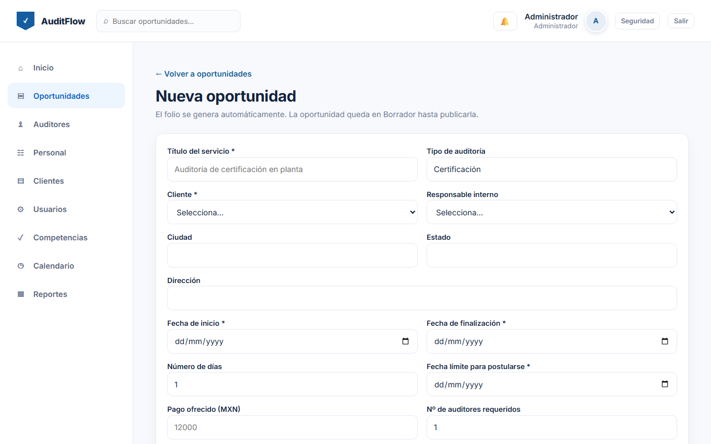

- La oportunidad queda en **Borrador**; botón **Publicar** para que la vean los auditores compatibles.
- En el detalle puedes **Asignar** a un auditor (el pago queda congelado), ver **Asignaciones**, **Documentos** e **Historial**.

---

## 5. Administrador — Personal técnico

Menú **Personal**: catálogo del personal (evaluadores, instructores, inspectores, examinadores) con sus puestos, áreas y correos.

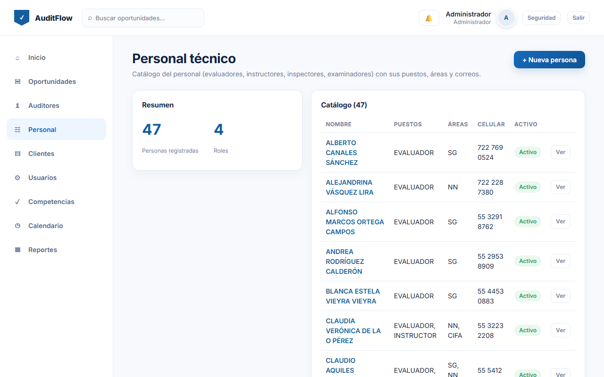

- **+ Nueva persona**: nombre, celular, puestos (✔), áreas (✔) y correos (varios, uno principal).
- En el detalle puedes editar todo y activar/desactivar.

---

## 6. Administrador — Auditores

Menú **Auditores**: catálogo de auditores externos. Al dar de alta se crea su cuenta de acceso.

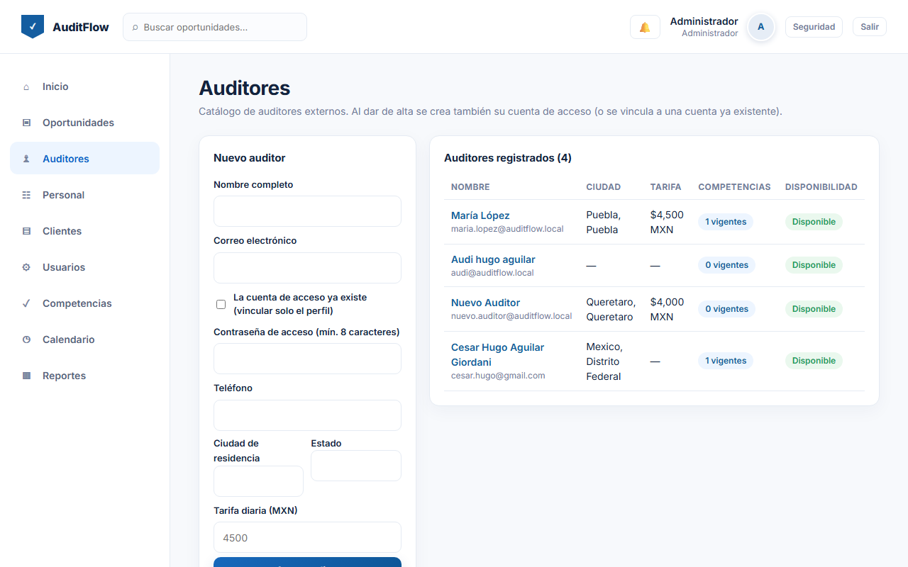

- En el detalle → **Matriz de competencias** → asignar norma con nivel y vigencia (vencida = no cuenta).

---

## 7. Administrador — Clientes

Menú **Clientes**: empresas que reciben las auditorías.

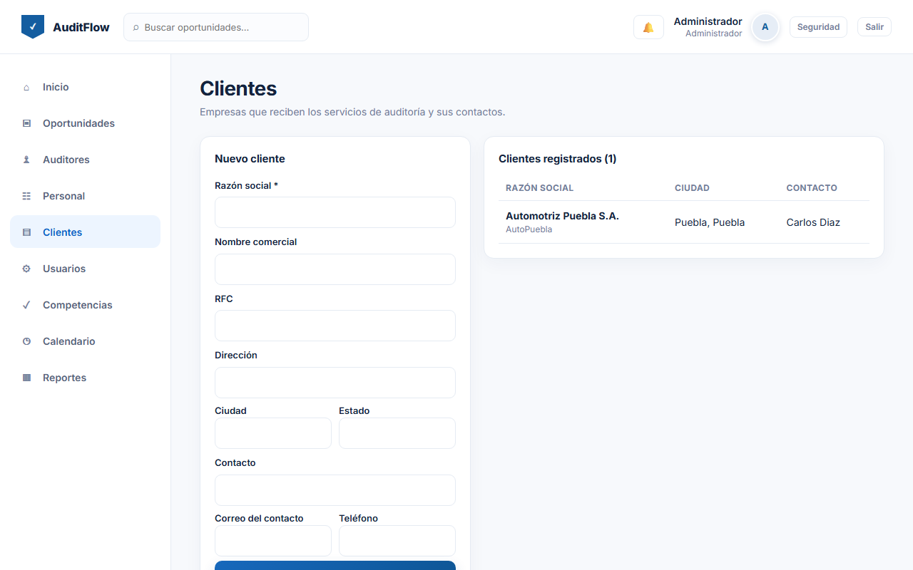

---

## 8. Administrador — Usuarios

Menú **Usuarios**: cuentas de acceso (Administrador / Auditor). Puedes **cambiar el rol** y **activar/desactivar**.

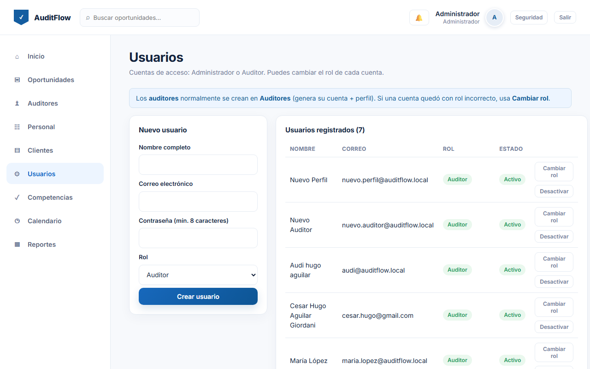

---

## 9. Administrador — Competencias

Menú **Competencias**: normas/especialidades (ISO 9001, etc.).

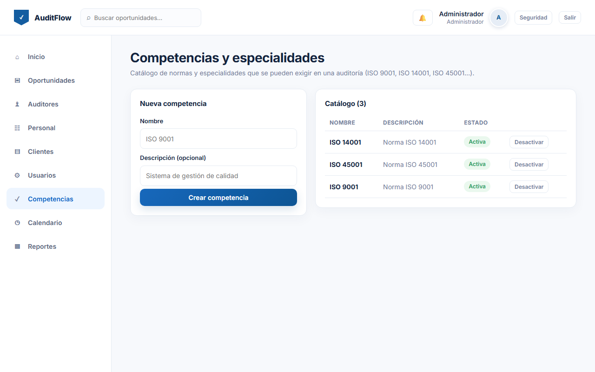

---

## 10. Administrador — Calendario

Menú **Calendario**: agenda de todos los servicios con asignación.

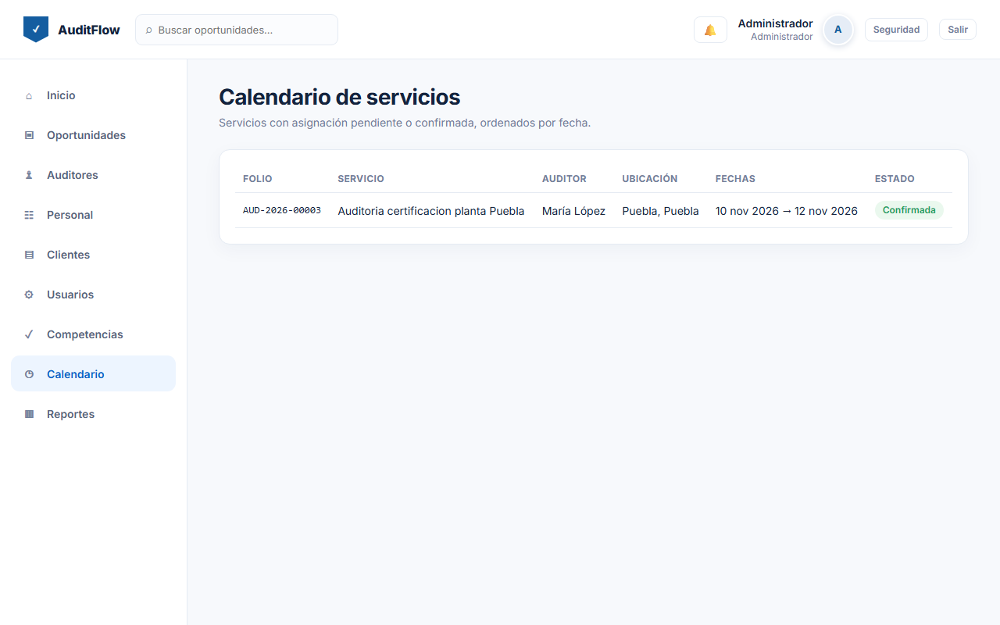

---

## 11. Administrador — Reportes

Menú **Reportes**: indicadores, servicios por cliente, auditores más utilizados, certificaciones por vencer y **exportar a CSV (Excel)**. Aquí también está el **mapa de México** y la **evolución temporal**.

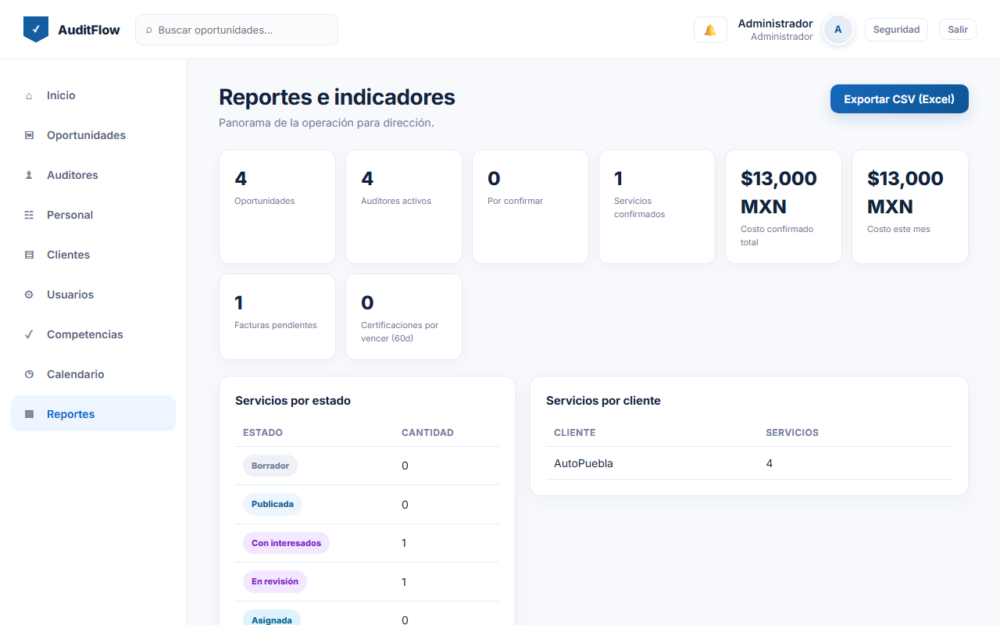

---

## 12. Auditor — Mi agenda

El auditor entra y solo ve su información.

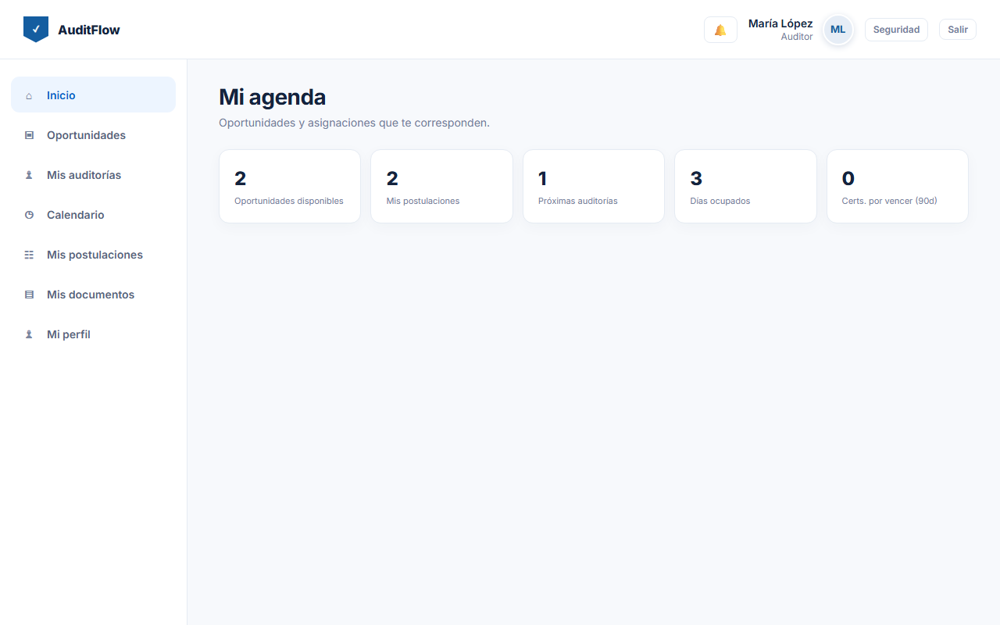

- **Oportunidades**: solo las compatibles con sus competencias vigentes y fechas libres.

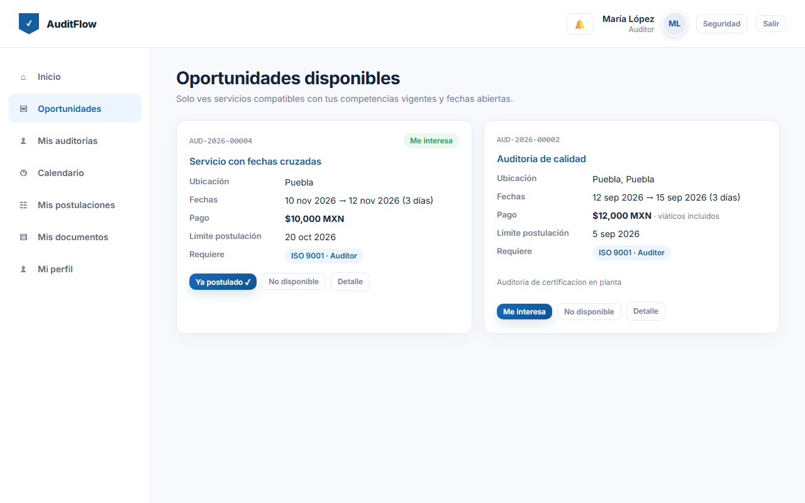

- En el detalle responde **Me interesa** (con comentario) o **No disponible**.

---

## 13. Auditor — Mis servicios

Servicios asignados. Confirma (**Confirmar**) o rechaza (**Rechazar**); al confirmar se bloquean tus fechas.

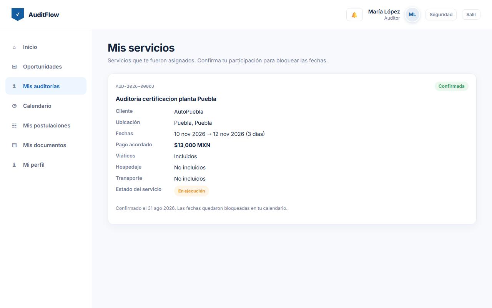

---

## 14. Auditor — Calendario

Próximos servicios y **indisponibilidades** (vacaciones/bloqueo).

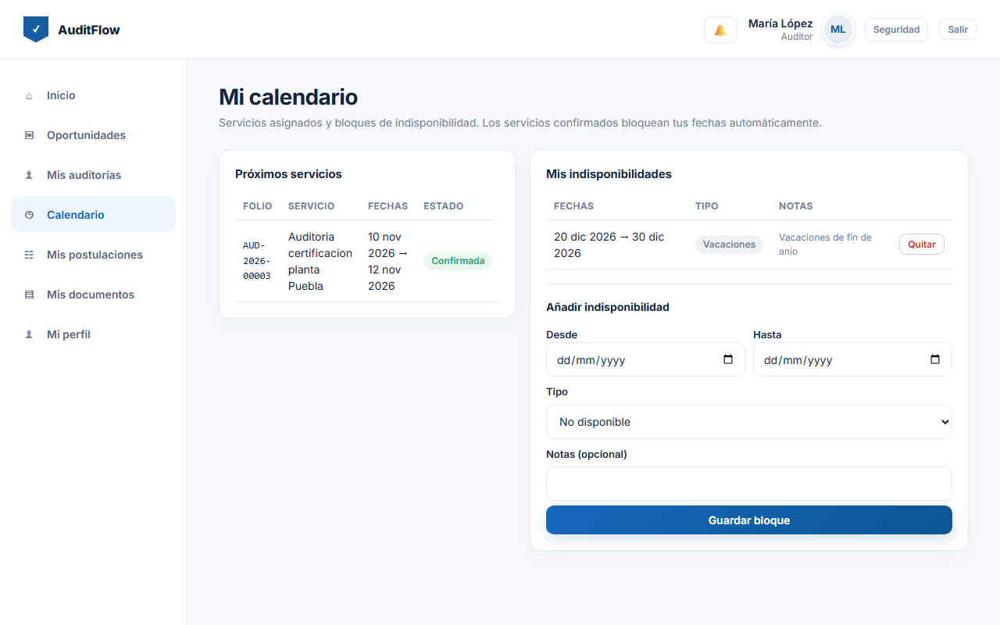

---

## 15. Auditor — Mi perfil

Tus datos y competencias.

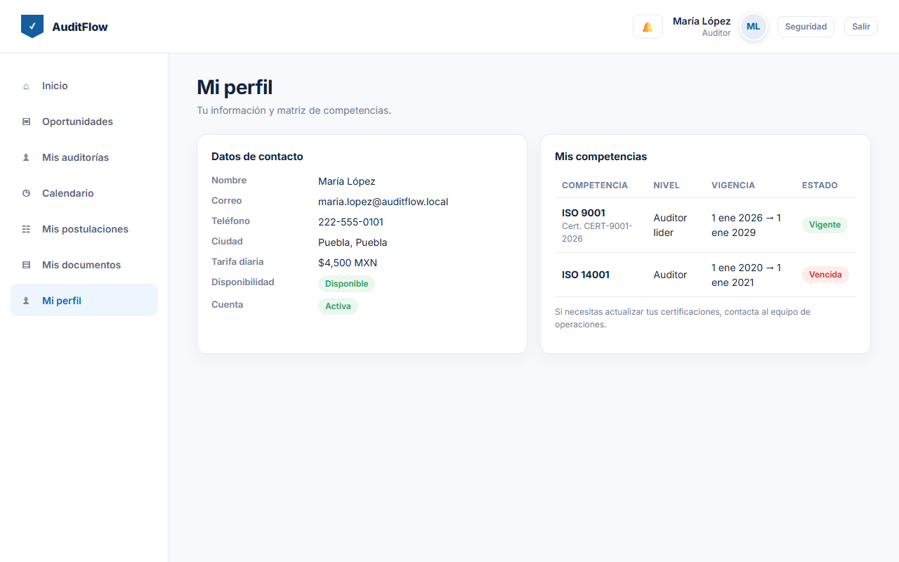

---

## 16. Flujo principal

1. **Operaciones** crea y publica una oportunidad.
2. El sistema la muestra solo a auditores compatibles.
3. Los auditores responden **Me interesa**.
4. Operaciones elige y **Asigna** (pago congelado).
5. El auditor **confirma** y se bloquean las fechas.
6. El servicio recorre sus estados hasta **Terminada/Paagada** o **Cancelada**.

## 17. Reglas de negocio

- Postular **no** asigna: el administrador siempre elige.
- Solo se ven/postulan servicios con **todas** las competencias **vigentes**.
- El **pago se congela al asignar**.
- Sin **fechas cruzadas** ni **bloqueos de calendario**.
- Todo queda en el **historial** (quién, cuándo, qué).
- Los auditores **no ven el nombre del cliente** hasta ser asignados.

---

## 18. Solución de problemas frecuentes

- **"Tu usuario no tiene perfil de auditor"** → crea el perfil en **Auditores** (o usa el botón **Cambiar rol** en Usuarios si la cuenta quedó mal).
- **El auditor no ve oportunidades** → revisa que tenga la competencia **vigente** y que la oportunidad esté **publicada** con fecha límite futura.
- **"Credenciales inválidas"** → usa el correo/contraseña que definiste en las variables de entorno del despliegue.
